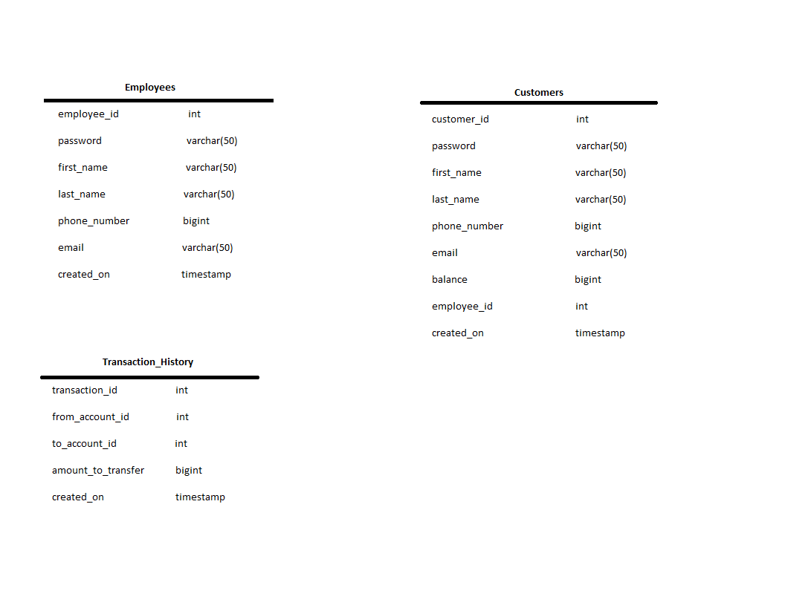

# Revature Project 0
By: Mario Sanchez, Jr. 		
Date: 2/23/2022

# Console-Based Bank Application

### Description:

A simple console-based application consisting of:
1. a main menu
2. an employee menu
3. a customer menu

### Technologies: 

1. Java
2. PostgresSQL for the database
3. JDBC to access the database from Java
4. log4j2 to log program information and errors

### Functionality:

1. Employees can:
	- log in
	- log out
	- create new customers
	- view all customers
	- view all transactions

2. Customers can:
	- log in
	- log out
	- transfer money to another account/customer
	- view their account information
	- view their transactions

### Tables Created:

### Assumptions:
1. Employees can only add customers, not delete them.
2. Customers can only make transfers, not deposit, withdraw or create their own account.
3. Customers only have one account as opposed to having a seperate savings and checking account.

### Improvements Going Forward:
1. Create a properties file so that the database's login information is not visible in the Java code.
2. Normalize the tables better to fit a more complex bank application.
3. Implement more tests using Mockito and JUnit5.
4. Add a few more user input checks to ensure they cannot enter incorrect information.

